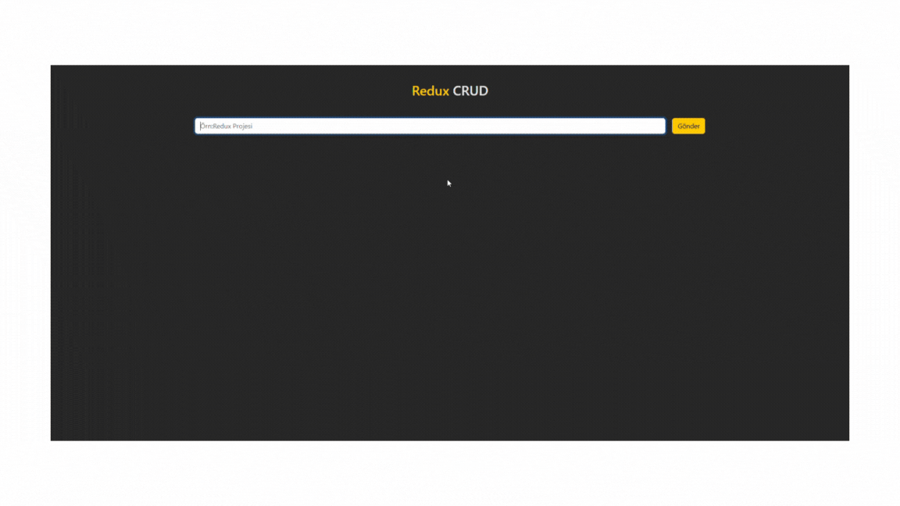

# 🛠️ CRUD Project with React-Redux

<h1>This project is a CRUD application created using the React-Redux library. It is designed for educational purposes to demonstrate fundamental concepts of Redux and related libraries.
</h1>

# 🚀 Features

<h2>Redux: Comprehensive state management.
Reducers: Manage and update states efficiently.
Actions & Dispatch: Centralized event handling. </h2>

<h1>React-Toastify: User-friendly notifications.</h1>

<h2>
📦 Libraries Used
🔥 React-Toastify: Toast notifications for better UX.
🎨 Bootstrap: Simple and responsive UI design.
🛠️ Axios: Handling HTTP requests seamlessly.
📂 JSON Server: Mock API for backend simulation.
</h2>

# 📝 Highlights

<h2>
Hands-on implementation of Redux concepts.
Interactive notifications with Toastify.
CRUD operations simulated using a local db.json.
Minimal yet functional design for learning purposes.
</h2>

<h1>CRUD operations include: </h1>

<h2>
Create new entries.
Read and view data.
Update existing entries.
Delete unwanted entries.
</h2>

# 🎉 Demo 🤝

